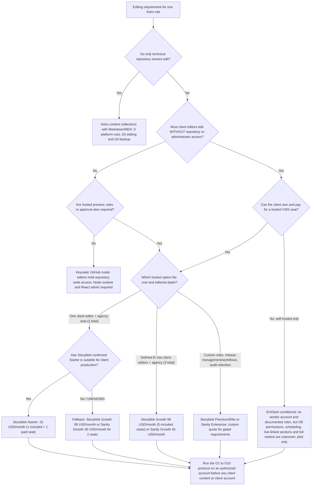

# Phase 2 — CMS strategy: capability comparison, POC evidence, and scenario decisions

**Task:** P2.6 — synthesize the Phase 2 research and both proof-of-concept outcomes into a scenario-specific CMS strategy (`docs/02-cms.md`).
**Retrieval date for every external fact, price, and plan limit:** 2026-09-22 (UTC). Sanity pricing/roles and Storyblok pricing were re-read directly on 2026-09-23 for this correction; Storyblok terms were also reviewed on 2026-09-23. The remaining first-party pages were read on 2026-09-22 by the Phase 2 research and POC tasks cited in §12.
**Status:** provisional recommendations for owner review at Checkpoint 1. `DECISIONS.md` D-005 forbids a universal CMS decision, so this document makes exactly three scenario decisions and no universal choice [47]. No account was created, no plan purchased, no deployment made, and no paid or account-gated behaviour is claimed as tested.

Evidence labels used throughout: **FACT** (stated by a cited source or binding project document), **ESTIMATE** (arithmetic or marked judgement derived from cited facts), **RECOMMENDATION** (proposed operating choice, pending the applicable owner checkpoint), **UNKNOWN** (not established by available evidence).

## 1. Executive recommendation

**RECOMMENDATION (the five required decisions):**

1. **Agency CMS — scenario A (the agency's own site):** use **native Astro content collections with Markdown/MDX** and no CMS platform. The operator is the only editor, owns the repository, and is technical, so the least-privilege constraint that disqualifies code-based editing for client staff does not apply [46][29]. Keep **EmDash** as a conditional alternative for the agency's own property, only if in-browser editing without a rebuild becomes a real requirement **and** the open permission, scheduling, restore, and upgrade gates in §11 are closed first; EmDash is not recommended merely because it was the easiest candidate to test locally [37][40].
2. **Default small-client approach — scenario B:** use a hosted option with a documented **Editor role without administrator or repository access**. For the defined B shape (two client editors plus one agency seat = three people), recommend **Storyblok Growth at $99/month per site** (five seats included) or **Sanity Growth at $45/month per site** (three billable seats) [13][1][35]. A reduced one-client-editor-plus-agency configuration is two people: Storyblok Starter costs **$15/month**, not $0, because its one included seat is followed by a $15 second seat [13]. However, Starter is described as for testing/personal projects while the page also says free to go live; the terms do not expressly resolve an agency-managed commercial client site. **Commercial suitability is UNKNOWN**: do not propose or use Starter for client production unless Storyblok confirms this use in writing [13][49]. Storyblok product behaviour remains **unmeasured** — all 22 protocol criteria were blocked at the account gate — so any first scenario-B engagement must run the O1–O10 protocol on an authorized free account before client content or a client account is involved [41][42]. **EmDash** is the conditional self-hosted alternative — no vendor account, documented roles, no seat metering — but it cannot be the default while permissions (O8, the criterion it was selected on), scheduling, live-linked sections, and complete restore remain unproven [37][38].
3. **Advanced-client CMS — scenario C:** where the advanced editorial requirements are satisfied by self-serve features, use **Storyblok Growth at nine seats ($159/month per site)** when visual editing, the component/block model, the asset manager, and locales dominate, or **Sanity Growth at nine seats ($135/month per site)** when the schema, Studio, Portable Text, and GROQ model dominates [13][1]. Ordinary scheduled publishing is available on self-serve tiers: Storyblok Growth/Growth Plus list two scheduled single stories, and Sanity Growth lists Scheduled drafts [13][1]. That is not the same as C's required custom roles, advanced release management/workflows, and audit retention. Storyblok Premium/Elite or Sanity Enterprise are custom-quoted because those specific requirements are tier-gated; do not treat ordinary scheduling alone as a quote trigger [13][1][3]. Price only the gated requirements as vendor-quote line items, not as assumptions. **EmDash remains a pilot candidate for C, not a recommendation** [37].
4. **When local Markdown/MDX is sufficient:** when the only editors are technical repository owners (or the agency edits on the client's behalf as a bounded service), content is mostly static, changes tolerate a build, and the project needs no role separation, draft/approval workflow, media library, scheduling, or visual editing [29][35].
5. **When alternatives are appropriate:** consider **Sanity** when the owner accepts paid editor seats, because the Free plan cannot express least privilege — every editor is an administrator — and the project wants the schema/GROQ/Studio model [1][2]. Consider **Keystatic** when repository-based editing is acceptable to the editors (GitHub mode), or when the client accepts team-level Cloud access with one team per client and needs no editorial roles, approval workflow, or vendor backups [10][11]. Consider **EmDash** when self-hosting with no vendor account is a hard requirement and the operator accepts runtime, database, upgrade, and recovery responsibility, subject to the gates in §11 [20][24]. Consider **Storyblok** when nontechnical visual editing is the primary requirement and the plan gates (seats, scheduling, SEO meta tags, managed backup) are priced explicitly [13][14].

**FACT (the deciding constraint):** permissions are the hard decision factor, not price or feature count. `AGENTS.md` requires that clients do not receive unnecessary repository or platform-administration access, and the Phase 2 analysis showed that only Storyblok and EmDash document a client-editor role below administrator at zero or near-zero seat cost [48][35]. Three of the five options fail that requirement as documented: Sanity's Free plan offers only Administrator and Viewer, Keystatic's GitHub mode makes repository write access the editing permission, and Astro content collections have no role model at all [1][10][29].

**RECOMMENDATION (how to read the evidence):** do not compare the two POCs as if they measured the same thing. Candidate 1 (EmDash, self-hosted) produced 18 criterion records; candidate 2 (Storyblok, hosted) produced none, because it ended at the account gate [38][42]. EmDash is locally testable, which is why it produced more evidence — not why it is more suitable for production [36][40].

## 2. How to read the status markers in §4

| Marker | Meaning | Example |
|---|---|---|
| **[V]** | Exercised in the Phase 2 EmDash POC with machine-checkable evidence under `pocs/phase-2/emdash/evidence/` [38] | media upload, signed preview, SQLite file restore |
| **[H]** | Exercised against the local credential-free Storyblok harness — the integration code path only, **not** vendor behaviour [41][44] | documented config build failure, block registration, draft/published routing against a mock CDN |
| **[D]** | First-party documented, **not exercised** in Phase 2 | Sanity visual editing, Storyblok Visual Editor, Keystatic Cloud |
| **[G]** | Documented plan or account gate | Sanity backups (Enterprise), Storyblok managed backup (Premium/Elite) |
| **[U]** | Not established by the evidence reviewed in Phase 2 | measured Sanity usage for one real site; Storyblok full-space export |

A **[D]** or **[G]** marker is not a negative product verdict and not a test result. It means the claim rests on documentation and must not be presented to a client as verified.

## 3. Validation performed for this synthesis

**FACT (Sanity validated rather than inherited).** The Sanity pricing page and roles documentation were re-read directly on 2026-09-22 and 2026-09-23 and confirm the facts this synthesis relies on: Free includes up to 20 seats with access to the **Administrator and Viewer roles only**; Growth is **$15 per seat/month** with up to 50 seats and the Admin, Viewer, Editor, Developer, and Contributor roles; Enterprise has custom seats and roles; custom roles are documented as a paid Enterprise feature; Tags are a Growth feature; Viewer-role users are free while assigning any additional role makes that user billable; and permissions are additive and cascade from "all datasets" down to individual datasets [1][2]. The same pricing page also lists a Growth "Increased quota" add-on at $299/month, extra datasets at $999 per dataset per month, and dedicated support at $799/month [1].

**FACT (re-validation scope).** Storyblok pricing was re-read on 2026-09-23 and the public terms were reviewed that day; see the corrected seat, scheduling, and commercial-use statements in §§1, 6, 7, 9, and sources [13][49]. The remaining Storyblok, Keystatic, EmDash, Astro, and Cloudflare claims in §4 and §7 come from Phase 2 artifacts retrieved on 2026-09-22 [34][35][41]. A later vendor change remains possible; §10 states that risk explicitly.

**FACT (evidence integrity re-checked).** For this synthesis both POC evidence manifests were re-verified in place: `pocs/phase-2/emdash/evidence/MANIFEST.sha256` → 194 OK, 0 FAILED; `pocs/phase-2/storyblok/evidence/run-01/MANIFEST.sha256` → 17 OK, 0 FAILED. The EmDash `operations.jsonl` hash recomputed to `ddefcfd6076d380327f59fed243846a8de338efb1380165fbcab4a8c7dd92178`, matching the hash recorded in the EmDash report [37][38].

## 4. Capability comparison across the five named options

Cells are compressed and status-marked per §2. "Not a page builder" is a documented product boundary for EmDash, not a defect claim [22].

| Dimension | Sanity | Keystatic | Storyblok | EmDash | Astro Markdown/MDX + content collections |
|---|---|---|---|---|---|
| Editing and nontechnical usability | Hosted Studio; schema-driven document and field editing [D][1][2] | Form-based admin writing content files; Markdoc field for WYSIWYG-like editing [D][9][8] | Visual Editor aimed at nontechnical collaborators; block/component editing [D][13][14] | Content create and edit proven through authenticated API/CLI evidence; the **browser admin UI was never reached** (sign-in screen only) [V][37][38] | Developer/Git editing; no CMS UI [D][29] |
| Drafts, preview, visual editing | Live previews and visual-editing tools included on Free; the Astro path needs server output, a viewer token, and CORS [D][1][7] | No hosted preview or draft service documented; preview is a deployment/branch design item [D][10][9] | Draft API plus iframe Visual Editor; **HTTPS preview required even on localhost**, with a `frame-ancestors` CSP [D][14][16] | Signed HMAC preview URL served the draft and expiry was enforced; no anonymous preview banner found, and the authenticated visual-editing UI was not reached [V: O4-a/O4-c pass, O4-b partial][37][38] | No built-in draft workflow; Git branches or hosting previews are project choices [D][29] |
| Visual editing affordances | Presentation Tool, click-to-edit overlays, live updates (requires SSR) [D][7] | None documented [D][10] | Click-to-edit, outlines, context menus and real-time preview in the vendor iframe [D][14] | `data-emdash-ref` attributes documented for editor affordances; **not exercised** [U][25] | None [D][29] |
| Media | Sanity image CDN and Portable Text rendering; asset files are not private even in a private dataset [D][6][5] | Image fields write into the repository or filesystem; Cloud Images on Pro [D][11][10] | Asset manager with folders, metadata, transforms, CDN delivery, and private assets [D][13] | Upload produced a ready media record whose binary hash matched the source; the page delivered the original and a transformed variant [V: O3-a/O3-b pass][37][38] | Astro asset tooling only; no media workflow or DAM [D][29] |
| Structured content | Schema types, references, Portable Text, GROQ [D][1][2] | Collections and singletons with typed fields [D][8] | Components and nestable blocks; content folders [D][13] | Database-first collections, taxonomies, menus, widgets, generated TypeScript types [D][21] | Loaders with optional schemas, validation, and type safety [D][29] |
| Reusable sections | Arrays/objects plus frontend components; no turnkey page builder [D][2] | Schema and content components; code owns rendering [D][8] | Components plus nested blocks are the documented section model [D][14][16] | Sections created and inserted into two posts, but editing the definition changed **neither** post: reuse is **copy-on-insert, not a live reference** (`first_old_copy=1, first_new_reference=0`; `second_old_copy=1, second_new_reference=0`) [V: O7 partial][38] | MDX/Astro components; code-driven reuse [D][29][31] |
| **Permissions (hard factor)** | Free: Administrator + Viewer only, so any client editor is a project administrator; Editor/Contributor from Growth at $15/seat; custom roles and content resources Enterprise-only; public datasets are readable by every member [D, re-validated][1][2] | GitHub mode: repository `write` access **is** the editing permission; Cloud sets access at team level with no editorial roles [D][10][11] | Owner/Admin/**Editor** on all plans including free Starter; custom roles Premium/Elite only; the more restrictive role wins when roles conflict [D][13][15] | Five documented roles (Subscriber, Contributor, Author, Editor, Admin) with no seat metering; **permissions unproven** — invite creation returned a manual-link fallback because no email transport existed [V: O8 blocked][23][37][38] | No role model; editing permission equals repository access [D][29] |
| Astro integration | Official `@sanity/astro`; static or server; visual editing requires `output: "server"` [D][6][7] | Official `@keystatic/astro`, but React and Markdoc integrations plus a Node-capable adapter are required [D][9][10] | Official `@storyblok/astro` (10.3.2, MIT, maintained in the `monoblok` monorepo) installs, typechecks, builds, and renders; the guide's own configuration **fails to build without an adapter** [H][16][41] | Astro integration with live content collections, so content changes need no rebuild; POC `typecheck` and `build` passed with development dependencies installed [V][28][37] | Native build-time and live collections; MDX integration available; live collections cannot render MDX or optimise images at runtime [D][29][31] |
| Hosting and runtime | Vendor-hosted Content Lake and Studio; the public site is the client's Astro deployment [D][1] | Host must run Node.js for the admin API routes; a purely static host is not a documented target [D][10] | Vendor CDN plus client/agency site hosting; separate staging environments are Premium/Elite [D][13] | Cloudflare Workers + D1 + R2, or Node.js + SQLite + S3-compatible storage; auth and preview secrets required in the deployment [D][26][20] | Static output by default; a server adapter is needed only for on-demand routes [D][30] |
| Free/paid platform cost | Free $0 (over-privileged roles); Growth $15/seat/month; Enterprise custom [D, re-validated][1] | MIT core $0; Cloud free up to 3 users per team, Pro $10/month/team plus $5/user beyond three — from the docs page, because no public pricing page exists [D][11][12] | Starter $0 for 1 total seat; one additional seat costs $15/month (max 2); Growth $99/month (5 seats, max 10); Growth Plus $349/month; Premium/Elite custom [D, re-validated][13] | MIT software $0; on Cloudflare, sandboxed plugins need Workers Paid from $5/month per account; on Node the sandbox runs locally [D][20][27][33] | $0 platform cost; costs become labour plus any adapter/hosting for on-demand routes [D][29][32] |
| Backups and recovery | Managed backups Enterprise-only (365-day daily plus two further years weekly); otherwise agency-run CLI export/import, which is documented as **not** a point-in-time reset [D][3][4] | Git history and repository backups; no CMS backup feature [D][10][11] | S3 Backups app into a customer-owned AWS bucket; frequency documented only for Premium (weekly) and Elite (daily); nothing on self-serve tiers; the restore dropdown lists 30 days [D][13][17] | JSON backup contains content, schema, sections, taxonomies, menus, revisions, and media **metadata**, and excludes users, sessions, passkeys, tokens, secrets, and media binaries; destructive SQLite file-level restore verified; no one-click JSON restore exercised [V][24][37][38] | Repository history; no CMS-managed backup or restore [D][29] |
| Export and portability | Dataset export/import via CLI, billed against the API quota [D][3][4] | The content **is** the repository; a clone equals an export [D][8] | JSON delivery model; CLI schema pull/sync and Management API CSV export; a full-space self-service export was not documented [U][13][16] | `export-seed` and the admin JSON backup both parsed; content and schema present, users, secrets, and media binaries absent [V: O9 pass][37][38] | Files in the repository; inherently portable [D][29] |
| Ownership and isolation unit | Client project inside an organization; a project can be moved between organizations by an owner; isolation per project [D][35] | Client repository; Cloud isolation is one team per client [D][10][11] | Client space; ownership transfers only to an account already added to that space [D][19] | Client-owned database, storage, and hosting account; no vendor control plane; MIT licence [D][20][26] | Client repository; MIT tooling [D][29][32] |
| Dependency and lock-in | Hosted Content Lake and plan features; CLI export mitigates but does not remove vendor dependence [D][1][3] | OSS packages plus optional Cloud; GitHub App and server environment variables for GitHub mode [D][10][11] | Hosted editor, CDN, and API; the former Astro SDK repository is archived and development moved to the monorepo [D][13][41] | No vendor dependency, but dependency on a **beta** project's upgrade path and on the chosen runtime (Cloudflare or Node) [D][20][24] | Astro framework plus the project's own integrations; MIT [D][32] |
| Security responsibilities | Token hygiene; assets public even in private datasets; additive-permission pitfalls with custom roles and user attributes [D][5][2] | GitHub App client id/secret and `KEYSTATIC_SECRET` in the deployment environment; repository-write boundary [D][10] | Public, preview, and management tokens separated; management credentials must never reach browser code; HTTPS preview [D][18][14] | Server-side secrets with signed preview and upload flows; POC evidence scanned clean for credential-like values, and the temporary local auth helper was deleted before final validation [V][37][38] | Build/deploy secrets only [D][30] |
| Maintenance state | Vendor-operated platform; Studio is MIT and actively released (v6.16.0 observed on 2026-09-22) [D][34] | MIT core with a protected `main` branch and CI; last observed commit 2026-09-08 [D][12] | Hosted platform; integration maintained in the monorepo; the guide's tested matrix has drifted from current packages [H][16][41] | **Beta preview**; a roughly five-month-old repository with 306 open issues at retrieval; the operator owns upgrades, migrations, patching, and monitoring [D][20][35] | Astro is MIT and actively released; the agency owns dependency updates [D][32] |

**FACT (vendor-claim boundary).** A plan that advertises preview, roles, or backups is not proof that this project's preview route, authentication boundary, deployment, and restore procedure work; §8 records exactly which of those were exercised.

## 5. Permissions, security, and ownership analysis

**FACT (least-privilege matrix, condensed from the Phase 2 analysis [35]).**

| Question | Sanity | Keystatic | Storyblok | EmDash | Astro content collections |
|---|---|---|---|---|---|
| Client editor can work with **no** repository access | Yes | GitHub mode: **No** / Cloud: Yes | Yes | Yes | **No** |
| A role below administrator exists for client staff | **Only on Growth** ($15/seat/month) | No editorial roles | Yes, from free Starter (Editor) | Yes (Contributor/Author/Editor), documented | No roles exist |
| Agency needs admin rights on the client account | On Free, yes (the only non-viewer role); Editor/Developer on Growth | Repository access plus GitHub App secrets | No — an Editor seat suffices | Editor/Admin in the site admin, plus hosting access if it operates the deployment | Repository write |
| Isolation unit | Project | Repository / team | Space | Deployment per site | Repository |

**RECOMMENDATION (permission posture, not a CMS choice).** For every engagement, write down before any account exists: which role the client's staff hold, which role the agency holds, who owns billing, and who can revoke access [35][48]. Two honest sentences to avoid: on Sanity Free it would be "the client's editor is an administrator"; on Keystatic GitHub mode it would be "the client's editor can change the code repository" [1][10].

**FACT (security posture per option).** Sanity warns that access tokens must never ship in browser JavaScript or repositories, that asset files are never private even in a private dataset, and that additive permission cascades can grant more than intended [5][2]. Storyblok separates public, preview, and management tokens and requires HTTPS for the preview iframe [18][14]. Keystatic keeps its GitHub App credentials in the deployment environment [10]. EmDash keeps auth and preview secrets server-side and signs preview URLs and uploads; the POC's evidence contained zero credential-like matches, and the disposable local helper used to obtain authenticated evidence was deleted before final validation, so the **supported browser login path remains unproven** [37][38]. Astro content collections add no credential surface of their own beyond build and deploy secrets [30].

**FACT (ownership).** All five options can be structured so the client owns the content, the accounts, and the exit path, but the mechanics differ [46][29]. Sanity projects can be moved between organizations by an owner, and datasets export via the CLI [1][3]. Storyblok space ownership transfers only to an account already added to that space [19]. Keystatic content lives in the client's repository, and Astro content lives in the repository by construction [10][29]. EmDash content lives in the client's own database and storage with no vendor account [20][26]. **UNKNOWN:** whether a client can own a Cloudflare account and grant the agency deployment-only access without account administration; this affects EmDash's 20-site ownership posture and was not researched [35].

## 6. Scenario decisions

Exactly three scenarios, as required and as defined in the Phase 2 scenario/cost artifact [35]. Scenario labels are planning frames, not claims about a future customer's requirements.

### 6.1 Scenario A — the agency's own site

- **Shape:** 8–12 pages, one insights stream, one technical editor (the operator), no client handoff, no approval workflow, no localization [35].
- **RECOMMENDATION:** **native Astro content collections with Markdown/MDX.** The operator is the only editor and owns the repository, so the scenario-B least-privilege constraint does not apply; platform cost is $0 and the content is the repository [46][29].
- **Conditional alternative:** **EmDash** if the agency wants in-browser editing without a rebuild, has tested section semantics, and accepts the operational surface (database, storage, secrets, migrations, monitoring) plus the beta risk; the POC proved that surface can work locally, which is exactly why local success must not be confused with production readiness [37][40][20].
- **Why not the others here:** Storyblok and Sanity add a hosted dependency and a monthly seat for a site the agency itself can edit in Git [13][1]. Keystatic adds a Node runtime and a React admin without giving the operator anything Markdown does not [9][10].

### 6.2 Scenario B — straightforward small-client site

- **Shape:** 8–15 pages plus an insights stream; two nontechnical client editors; one agency seat; single language; 200–500 documents; the client owns domain, hosting, CMS account, repository, analytics, and backups; client editors must not receive repository or platform-administrator access [35][46].
- **Binding constraint (FACT):** a client-editor role must exist **without** administrator or repository access [35][48].
- **RECOMMENDATION:** for the defined two-client-editor shape, **Storyblok Growth at $99/month** covers three people within its five included seats; **Sanity Growth at $45/month** covers three billable seats [13][1][35]. A reduced one-client-editor plus one agency seat is two people and costs $15/month on Starter (one included seat plus one $15 additional seat), not $0 [13]. **UNKNOWN:** Storyblok labels Starter for testing and personal projects while also advertising "Free to go live"; the public terms allow an organization to self-serve for internal business purposes but also restrict resale/commercial exploitation of the service, without expressly resolving agency-managed commercial client production. Obtain written vendor confirmation before proposing or using Starter for client production; if unresolved, use Growth or Sanity Growth [13][49]. The documented Editor role exists on all plans, with custom roles gated to Premium/Elite [13][15].
- **Precondition (FACT):** Storyblok's product behaviour is unmeasured — all 22 protocol criteria were blocked at the account gate, and the harness verified only the integration code path against a mock CDN [41][42][44]. The first scenario-B engagement must therefore run the O1–O10 protocol on an authorized free account (one space, a second inbox for the invited Editor, declining the advertised 45-day Growth Plus trial) before any client content or client account is involved [41]. That product test does not resolve Starter's commercial-use ambiguity; written confirmation is still required before Starter is proposed for client production [13][49].
- **Conditional self-hosted alternative:** **EmDash**, where the client can own — or the agency can operate under a written agreement — a Cloudflare or Node deployment, and only after the O8 permission test, scheduling, live-linked sections, complete restore, and upgrade tests are closed [37][38][24].
- **When Markdown/MDX is the right answer instead:** when the client does not edit at all and the agency performs content edits as a bounded service; the $0 file-based path is then sufficient and no CMS account enters the handover [29].
- **Rejected for B as configured:** Sanity Free makes any editor an administrator [1]. Keystatic GitHub mode requires repository write access to edit, and Keystatic Cloud grants team-wide access with no editorial roles [10][11]. Astro content collections alone have no role model at all [29].
- **Cost line (FACT):** for defined B's three people, the comparison is Storyblok Growth $99/site/month versus Sanity Growth $45/site/month versus EmDash ($0 software licence; hosting/operations vary and permissions remain unproven) [35][13][1]. The optional two-person case is Storyblok Starter $15/site/month only if commercial use is confirmed, or Sanity Growth $30/site/month; Starter is $0 only for one total seat [13][49][1].

### 6.3 Scenario C — advanced editorial client

- **Shape:** multi-author publication, eight client editorial seats plus one agency seat, draft/approval separation, scheduled publishing, version history of at least 90 days, media library, two locales, 5,000–25,000 documents; custom roles, advanced release/scheduling workflow, and audit retention are **required features, not nice-to-haves** [35]. Here the release/workflow requirement means more than ordinary scheduled publishing: Storyblok Growth lists two scheduled single stories and Sanity Growth lists Scheduled drafts, so those self-serve features alone do not trigger an upgrade [13][1]. For a publication whose core need is membership, Portal, and newsletters, the Ghost path governs instead (D-004) [47][46].
- **RECOMMENDATION (where self-serve features suffice):** **Storyblok Growth at nine seats, $159/month per site**, when visual editing, the component/block model, the asset manager, locales, and ordinary scheduling dominate [13]; **Sanity Growth at nine seats, $135/month per site**, when the schema/GROQ/Portable Text/Studio model and scheduled drafts dominate and paid editor seats are approved [1].
- **RECOMMENDATION (when C's stated requirements are enforced):** Storyblok custom roles, custom workflows/Release Management, environments, and managed backups are Premium/Elite gates; its listed versioning/activity/webhook-log retention is 30 days on Growth, 180 days on Premium, and unlimited on Elite [13]. Sanity custom roles, user attributes, content resources, full audit trail, managed backups, and custom history retention are Enterprise features [1][2][3]. Quote the applicable higher tier for those actually gated requirements; ordinary scheduled publishing alone is not a quote trigger. A scenario-C proposal must state the gate rather than promise the feature.
- **EmDash for C:** revisions, draft/live separation, media, signed preview, SEO output, and section insertion were exercised in the POC, but scheduling, two-actor permissions, live-linked reusable sections, and complete restore (including media binaries and auth secrets) remain unproven, and the project is beta-stage [37][38][24]. EmDash may reduce vendor seat cost for advanced editorial work but shifts operational risk to the owner; it belongs in a pilot, not in a client commitment, on current evidence.
- **Keystatic and Markdown/MDX for C:** Keystatic documents no editorial roles, no approval workflow, and no hosted preview, and its Cloud access is team-wide [11][10]; Astro content collections would require assembling a separate editorial system [29]. Neither meets C as stated.

## 7. Cost model at 1, 5, and 20 sites

**FACT (price constants, monthly USD):** all were retrieved on 2026-09-22; Storyblok pricing was rechecked on 2026-09-23. Sanity Growth is $15.00/seat [1]. Storyblok's extra seat is $15.00, Growth is $99.00 with 5 seats included and a maximum of 10, and Starter includes one seat with a two-seat maximum [13]. Keystatic Cloud Pro is $10.00 per team per month plus $5.00 per user beyond three [11]. Cloudflare Workers Paid has a $5.00 minimum per account [33]. EmDash, Keystatic, and Astro carry $0.00 in licence fees [20][12][32].

**Assumptions (stated because every figure depends on them):**

1. **Seat shapes:** scenario A = 1 billable seat per site; scenario B = 3 billable seats per site (two client editors plus one agency seat); scenario C = 9 billable seats per site (eight client editors plus one agency seat) [35].
2. **Isolation:** one isolated repository, account, CMS instance, and backup per site per D-003; no shared tenancy is priced [47][35].
3. **Billing basis:** the **monthly** list price is used in every cell. Storyblok also publishes annual-billing figures ($90.75 and $319.91) whose qualifier is unlabelled on the page, so those figures are deliberately not used [13][35].
4. **EmDash hosting:** $5.00 per client Cloudflare account assumes the Workers Paid plan, which is required for sandboxed plugins on the Cloudflare path; on Node.js the plugin sandbox runs locally, so that paid requirement does not apply to a Node deployment [27][33].
5. **Excluded from every figure (and therefore not a total cost of ownership):** agency labour, domains, TLS, email, forms, analytics, image CDN, the public site's own hosting, transaction fees, and taxes; labour stays unpriced until the pilots measure it [46][35].
6. **Not a forecast:** the 5-site and 20-site columns are arithmetic, not a claim that twenty clients exist [35].

### 7.1 Scenario A — agency site (1 billable seat per site)

| Option | 1 site | 5 sites | 20 sites | Annual at 20 sites |
|---|---|---|---|---|
| Sanity Growth | $15.00 | $75.00 | $300.00 | $3,600.00 |
| Sanity Free (Administrator/Viewer only) | $0.00 | $0.00 | $0.00 | $0.00 |
| Storyblok Starter (one seat; commercial eligibility UNKNOWN) | $0.00 | $0.00 | $0.00 | $0.00 |
| Keystatic Cloud | $0.00 | $0.00 | $0.00 | $0.00 |
| EmDash (Cloudflare Workers Paid) | $5.00 | $25.00 | $100.00 | $1,200.00 |
| EmDash (Workers Free, no sandboxed plugins) | $0.00 | $0.00 | $0.00 | $0.00 |
| Astro content collections | $0.00 | $0.00 | $0.00 | $0.00 |

### 7.2 Scenario B — small client (3 billable seats per site)

| Option | 1 site | 5 sites | 20 sites | Annual at 20 sites |
|---|---|---|---|---|
| Sanity Growth | $45.00 | $225.00 | $900.00 | $10,800.00 |
| Sanity Free (Administrator/Viewer only) | $0.00 | $0.00 | $0.00 | $0.00 |
| Storyblok Growth (3 users exceed the Starter cap) | $99.00 | $495.00 | $1,980.00 | $23,760.00 |
| Keystatic Cloud | $0.00 | $0.00 | $0.00 | $0.00 |
| EmDash (Cloudflare Workers Paid) | $5.00 | $25.00 | $100.00 | $1,200.00 |
| EmDash (Workers Free, no sandboxed plugins) | $0.00 | $0.00 | $0.00 | $0.00 |
| Astro content collections (editing unsolved) | $0.00 | $0.00 | $0.00 | $0.00 |

**ESTIMATE (reduced-seat alternative, not the defined scenario B):** one client editor plus one agency seat is **two total people**, so Storyblok Starter is $15/site/month (one seat included plus one $15 seat), not $0 [13]. At 1/5/20 sites that is **$15/$75/$300 per month**, and **$3,600/year at 20 sites**. This is pricing arithmetic only: Starter commercial use for a client production site remains **UNKNOWN** pending written vendor confirmation; if unconfirmed, use Storyblok Growth ($99/month) or Sanity Growth ($30/month for two billable seats) [13][49][1].

### 7.3 Scenario C — advanced editorial (9 billable seats per site)

| Option | 1 site | 5 sites | 20 sites | Annual at 20 sites |
|---|---|---|---|---|
| Sanity Growth | $135.00 | $675.00 | $2,700.00 | $32,400.00 |
| Sanity Enterprise features (custom roles, audit, managed backups) | custom | custom | custom | unpublished (UNKNOWN) |
| Storyblok Growth | $159.00 | $795.00 | $3,180.00 | $38,160.00 |
| Storyblok Premium/Elite (custom roles, environments, managed backups) | custom | custom | custom | unpublished (UNKNOWN) |
| Keystatic Cloud Pro | $40.00 | $200.00 | $800.00 | $9,600.00 |
| EmDash (Cloudflare Workers Paid) | $5.00 | $25.00 | $100.00 | $1,200.00 |
| Astro content collections | $0.00 | $0.00 | $0.00 | $0.00 |

### 7.4 Sensitivity notes

- **Sanity: seats, not sites, drive the bill.** At 20 sites the same option ranges from $300 to $6,000 per month depending only on seats per site (1 / 3 / 5 / 9 / 20 seats), and the Free plan's 20 free seats buy 20 *administrator* seats rather than least privilege [1][35].
- **Storyblok: seat count and Starter suitability both matter.** Starter is $0 for one total user; one client editor plus one agency seat is two total users and costs $15/site/month. Across 1/5/20 sites that optional case is $15/$75/$300 per month and $3,600/year at 20 sites; it is not a commercial-client recommendation until Storyblok confirms eligibility in writing [13][49]. The defined B shape (two client editors plus one agency seat) is three users and requires Growth at $99/site/month, or $99/$495/$1,980 across 1/5/20 sites and $23,760/year at 20 sites [13][35]. The $84/site/month increase is the difference between those two seat shapes, not a claim that Starter is suitable for client production.
- **Keystatic: the third-to-fourth-user step is $15/month per team**, and one Pro subscription covers one team only, so cost scales with the number of clients exceeding three users, not with site count [11].
- **EmDash: the licence is free and the platform bill is trivial; the real cost is operational** — updates, migrations, plugin sandbox configuration, backup and restore procedures, monitoring, and the beta-stage risk [20][24][27].
- **Astro content collections: $0 in platform fees, and the trade is labour.** For scenarios B and C the editing requirement is not solved by the framework alone; either the agency performs edits as a service or another option from this list is added, at which point its costs and permissions apply [29].
- **Usage headroom is unlikely to bind at these sizes (ESTIMATE).** Against scenario C's modelled 10,000 documents, Sanity Growth includes 25,000 documents and 1M API CDN requests, and Storyblok Growth includes 400 GB traffic, 1M API requests, 25,000 stories, and 2,500 assets; only Storyblok's asset ceiling and Sanity's API-request allowance warrant per-client re-checking [1][13][35].

## 8. POC evidence and its boundary

**FACT (protocol).** Both candidates ran against the identical ten-operation protocol defined before the runs: O1 create content, O2 edit text, O3 upload/select image, O4 preview draft, O5 publish, O6 edit SEO, O7 reuse page sections, O8 manage/test permissions, O9 export, O10 recover from backup, with sub-criteria wherever one operation carries independent claims [36]. The rules that shape everything below: no pre-claiming from documentation; a pass requires machine-checkable evidence; **blocked is a first-class result** recorded with its exact gate; roles are named for each observation; each run is timeboxed to one working day; and the two candidates' results may not be averaged into a winner number or compared across differing status kinds without stating the asymmetry [36].

### 8.1 Candidate 1 — EmDash (self-hosted, MIT)

**FACT (run):** EmDash `0.38.0` on the generated Astro starter (`astro` 7.3.3, `@astrojs/node` 11.1.6) with SQLite and local uploads; **18 criterion records — 11 pass, 4 partial, 3 blocked, 0 fail, 0 not_attempted**; 194 hashed evidence artifacts, manifest re-verified 194 OK / 0 FAILED for this synthesis [38][39][37].

| Op | Sub-criterion | Status | Observation (one line) |
|---|---|---|---|
| O1 | create content | pass | Post `poc-test` created and readable through independent paths, with a stable slug [38] |
| O2 | edit text | pass | A draft revision was created while `liveData` retained the previously published values [38] |
| O3 | a) upload / b) render | pass / pass | Media record `ready` with a matching binary hash; the page emitted the `` with the exact alt text and original plus transformed URLs returned HTTP 200 [38] |
| O4 | a) draft fetch / b) preview UI / c) expiry | pass / partial / pass | The signed URL served the draft; no anonymous preview banner was found and the authenticated visual-editing UI was not reached; a 1-second token was refused after expiry [38] |
| O5 | a) publish / b) draft-live separation / c) scheduling | pass / pass / **blocked** | Publish and separation were re-verified after a later draft edit; the scheduling attempt failed authentication after the disposable helper was removed, so **no scheduled publication is claimed** [38] |
| O6 | a) SEO output / b) native SEO surface | pass / partial | Exact title, description, canonical, and `robots: noindex, nofollow` rendered in `<head>`; the admin SEO panel was not visually completed, and the CLI rejected `seo` as an ordinary collection field [38] |
| O7 | reusable sections | partial | A section was created and inserted twice, but editing the definition updated neither post (`first_old_copy=1, first_new_reference=0`; `second_old_copy=1, second_new_reference=0`) — copy-on-insert, not a live reference [38][40] |
| O8 | a/b/c permissions (hard criterion) | **blocked** | Invite creation returned HTTP 200 with "No email provider configured — share the link manually"; no second actor accepted, was denied, or was revoked, and role definitions are not permission evidence [38][36] |
| O9 | export and exclusions | pass | `export-seed` and the admin JSON backup both parsed; users, sessions, secrets, passkeys, and media binary fields were asserted absent [38] |
| O10 | a) file restore / b) JSON restore / c) vendor backup | pass / partial / **blocked** | Destructive SQLite file restore verified against the backup hash; no JSON import route was exercised; no vendor backup path exists in a self-hosted local run [38] |

**FACT (evidence boundary).** Every status maps to a file in `pocs/phase-2/emdash/evidence/`; `validate_operations.py` reported 18 well-formed records with zero missing evidence paths; typecheck and production build passed with development dependencies installed; the dependency audit reported 0 vulnerabilities [37][38]. The boundaries are equally explicit: the **supported browser authentication and admin UI were never reached** (the retained screenshot is the sign-in screen); the authenticated evidence was obtained through a **disposable local helper that was deleted before final validation**; no authenticated dashboard is claimed; permissions and scheduling are unproven; live-linked sections are contradicted by observation; and upgrade/migration, plugin sandbox, Cloudflare deployment, media-binary and secret recovery, and production stability were not tested [37][38][40]. The public frontend stayed framework-free, but the admin requires React 19 — a documented requirement that must be recorded against the project's no-unnecessary-framework constraint [37][48].

### 8.2 Candidate 2 — Storyblok (hosted)

**FACT (run):** the candidate could not be executed. No account, space, session, token, or CLI exists in this environment and account creation was not authorized, so **all 22 protocol criteria are recorded blocked with their exact gate — 19 × ACCOUNT_REQUIRED and 3 × PLAN_GATED (O5-c scheduling, O6-b native SEO, O10-c vendor-managed backup) — and 0 criteria passed** [41][42][43]. Every sub-criterion and its gate, taken from the run's machine-readable records:

| Op | Sub-criterion | Gate | Blocked because (condensed) |
|---|---|---|---|
| O1 | create content | ACCOUNT_REQUIRED | creating a story needs an account and a space [42] |
| O2 | edit text | ACCOUNT_REQUIRED | the editor surface is inside the vendor app; Starter retains versions for 1 day [42] |
| O3-a | image upload | ACCOUNT_REQUIRED | the Asset Manager is inside the vendor app [42] |
| O3-b | image render/select | ACCOUNT_REQUIRED | serving a CDN asset needs a real space; unverified spaces may restrict file types [42] |
| O4-a | draft fetch | ACCOUNT_REQUIRED | a real draft fetch needs a preview token issued from a space [42] |
| O4-b | Visual Editor bridge | ACCOUNT_REQUIRED | the Visual Editor needs a space; the secondary gate is the HTTPS preview requirement even on localhost [42] |
| O4-c | preview expiry / CSP | ACCOUNT_REQUIRED | frame acceptance is decided by the vendor origin; only our own header emission was verified [42] |
| O5-a | publish | ACCOUNT_REQUIRED | publishing needs the vendor app or a management token [42] |
| O5-b | draft/published separation | ACCOUNT_REQUIRED | exercised against local fixtures only, which cannot evidence vendor behaviour [42] |
| O5-c | scheduling | PLAN_GATED | scheduled single stories appear from Growth; the Starter row is blank [42] |
| O6-a | modelled SEO fields | ACCOUNT_REQUIRED | modelled fields render in the harness; an editor setting them in the CMS needs an account [42] |
| O6-b | native SEO feature | PLAN_GATED | "SEO meta tags" is listed as a Growth enhancement and is absent from the Starter card [42] |
| O7 | reuse page sections | ACCOUNT_REQUIRED | component reuse was verified in code; the block library and copy-versus-reference semantics live in the vendor app [42] |
| O8-a | editor can edit | ACCOUNT_REQUIRED | needs an invited and accepted second actor [42] |
| O8-b | editor cannot administer | ACCOUNT_REQUIRED | a real denial cannot be produced without the app; Starter caps seats at 2 and a second inbox would be required [42] |
| O8-c | revocation | ACCOUNT_REQUIRED | there are no users to revoke [42] |
| O9-a | export produced | ACCOUNT_REQUIRED | CLI and Management API export need an account token [42] |
| O9-b | export contents | ACCOUNT_REQUIRED | no space content exists to export [42] |
| O9-c | export exclusions | ACCOUNT_REQUIRED | exclusion assertions need a real export artifact [42] |
| O10-a | restore exercised | ACCOUNT_REQUIRED | there is no space content to damage and restore [42] |
| O10-b | documented restore path | ACCOUNT_REQUIRED | the restore UI is inside the vendor app, and its dropdown lists only the last 30 days [42] |
| O10-c | vendor backup path | PLAN_GATED | the S3 Backups app needs a customer-owned AWS bucket, and backup frequency exists only on Premium (weekly) and Elite (daily) [42] |

**FACT (secondary gates a future run would meet).** The blocked records also name the gates that would follow account creation: a second deliverable inbox for the invited Editor, the HTTPS preview requirement "whether deployed or on localhost", and a customer-owned AWS bucket for the only vendor backup path [41][42].

**FACT (what was executed instead — harness, not vendor proof).** A credential-free harness exercised the official `@storyblok/astro` integration against a **local mock CDN**: **15 of 15 harness checks passed** (H0–H14), covering package installation, typecheck (0 errors), the documented configuration failing to build without an adapter, an on-demand build with the official Node adapter, served HTML, draft/published routing, one component definition in two content items, nested blocks, modelled SEO fields in `<head>`, the site's own `frame-ancestors` CSP, the client's request transcript (`version=draft|published`, token parameter present), a static build, a clean secret scan, and inspected screenshots [41][44]. **This is evidence about our integration code path and about the documentation, not evidence about Storyblok's product**: the vendor was never contacted, and no harness check may be read as a product capability [41][45]. Four findings do carry decision weight. `@storyblok/astro` 10.3.2 is MIT and maintained in the `monoblok` monorepo, which resolves the earlier UNKNOWN [41]. The official Astro guide's configuration fails to build as written, and the guide's tested matrix has drifted from current packages [41][16]. A host-level `NODE_ENV=production` trap can produce a false-passing typecheck [41]. Finally, the integration injects a 2271-byte bridge script into public pages by default, which the delivery standard must decide on explicitly under the project's client-JavaScript constraint [41][48].

### 8.3 Cross-candidate rules applied here

**FACT.** (1) The two runs are **not comparable as measurements**: candidate 2 produced zero criterion results, so any "winner" arithmetic would be fabricated [36][42]. (2) Sub-criteria are reported with their exact statuses, including the three blocked EmDash records, rather than collapsed into an operation-level pass [38][36]. (3) Nothing that was blocked, partial, or plan-gated is upgraded anywhere in this document: EmDash scheduling, EmDash permissions, EmDash JSON restore, Storyblok's entire product surface, and both platforms' vendor-managed backup paths remain open [38][42]. (4) Counts in §8 were cross-checked against the machine-readable records. The EmDash `operations.jsonl` holds 18 records (11/4/3/0/0 by status) and its `summary.json` agrees [38][39]. The Storyblok `operations.jsonl` holds 22 records (19 ACCOUNT_REQUIRED, 3 PLAN_GATED), and its `summary.json` records 0 criteria passed, no account, no payment, and no deployment [42][43].

## 9. CMS decision tree

**RECOMMENDATION (provisional; every path still requires the §11 follow-ups).** The tree encodes §6; it is a routing aid, not a universal CMS decision. Storyblok Growth lists two scheduled single stories and Sanity Growth lists Scheduled drafts; ordinary scheduled publishing is not the same as advanced release management or custom workflows [13][1].

Reading the tree: the agency's own site (scenario A) is the `C` branch; defined scenario B is `J3` (Storyblok Growth at $99/month for three total users, or Sanity Growth at $45/month), with `L` as the conditional self-hosted path. `I` is only the reduced two-person alternative and requires written confirmation of Starter's commercial suitability; `J2` is its fallback. Scenario C uses `K` only when its custom-role, advanced-release, or audit requirements require the corresponding paid higher tier [46][35].

## 10. Risks, unknowns, and gates

1. **Storyblok is a documentation-only recommendation today.** Zero vendor operations are measured; the entire product surface, including the least-privilege Editor role this recommendation leans on, is unverified in this project [41][42]. Separately, Starter's suitability for commercial client production is **UNKNOWN** because the public plan description and terms do not clearly resolve the agency-managed client-site case [13][49].
2. **EmDash's permission core is unproven.** O8, the criterion the candidate was selected on, is blocked by the missing email transport, and the browser admin flow was never reached [37][38][36].
3. **EmDash is beta software.** A roughly five-month-old repository with 306 open issues at retrieval, no one-click JSON restore, and documented backup exclusions (users, secrets, passkeys, media binaries) means a passing file-level restore is not a disaster-recovery story [20][24].
4. **EmDash's reusable sections are copy-on-insert.** Anywhere synchronized section updates are expected, this is a requirements gap, not a preference [38][40].
5. **Self-hosting converts platform cost into operating cost.** Migrations, runtime patching, secret handling, monitoring, incident response, and upgrade testing become the agency's or client's obligations, and no measured hours exist yet [20][27][46].
6. **Plan gates can silently become promises.** Ordinary scheduling is self-serve: Storyblok Growth/Growth Plus list two scheduled single stories and Sanity Growth lists Scheduled drafts [13][1]. This is distinct from advanced release management, custom workflows/roles, and audit retention: Storyblok Release Management, custom roles/workflows, environments, and managed backups are Premium/Elite gates; Sanity custom roles and full audit/history retention are Enterprise features [13][1][2]. Keystatic Cloud publishes no pricing page, so its tiers cannot be quoted from a price list at all [11].
7. **Sanity Free cannot express least privilege**, so a Sanity recommendation is implicitly a $15/seat/month decision that belongs to the owner [1][2].
8. **Keystatic's access model is coarse.** Repository write access for GitHub mode and team-wide access for Cloud, with no editorial roles [10][11].
9. **Vendor drift.** The base price/limit snapshot is 2026-09-22; Sanity pricing/roles and Storyblok pricing/terms were rechecked on 2026-09-23. Re-retrieve all prices, limits, and plan gates before quoting [13][49][1].
10. **Re-validation was partial.** Sanity pricing/roles and Storyblok pricing/terms were re-opened on 2026-09-23; the remaining vendor claims rest on the 2026-09-22 Phase 2 retrievals, so changes to those pages would not be caught here [34][35][41].
11. **Ownership mechanics are not fully resolved** for a self-hosted EmDash site at scale (Cloudflare account-role granularity) and for Storyblok space transfer, which requires the recipient to already be a user of the space [35][19].
12. **Process lesson from the runs:** the POC plan's port allocation is not concurrency-safe — a sibling dev server on port 4321 answered the first Storyblok harness HTTP checks until it was caught [41]. Future browser-facing work must serialize runs or verify disjoint ports [36].

## 11. Prioritized follow-up list

Priority order reflects what unblocks the largest decision with the least spend; each item names its owner-facing gate. Nothing here authorizes account creation, purchase, or deployment before the applicable checkpoint [47][48].

1. **Owner decision: is a paid client-editor seat acceptable?** A yes (for example $15/seat/month) removes Sanity's hard-gate failure and makes it a strong third candidate; a no keeps scenario B on Storyblok/EmDash [1][2][35].
2. **Resolve Starter commercial suitability and authorize testing separately.** Obtain written Storyblok confirmation before proposing or using Starter for a commercial client site; the account test does not settle that terms question. If authorized, use one free Starter space (second inbox for the invited Editor, decline the Growth Plus trial, no card) and run the full O1–O10 protocol [13][49][41].
3. **Close EmDash's hard gates** before any client-facing recommendation: configured email transport or OAuth plus a second actor for O8, an authenticated scheduling test, a JSON/media/secret recovery test, and an upgrade/migration test on the supported path [37][38].
4. **Decide the reusable-section requirement** — copy-on-insert versus live-linked — and record it as a schema/component contract for whichever CMS is chosen [38][40].
5. **Define the handover package per option**: which role the client holds, which account owns billing, how tokens are revoked, where backups live, and who restores them [48][35].
6. **Resolve Keystatic Cloud's real price/limits** if it is to be quoted, since no public pricing page exists and the $10/$5 figures come from documentation text [11].
7. **Resolve Cloudflare account-role granularity** for EmDash ownership at scale (can a client own the account and grant deployment-only access?) [35].
8. **Re-retrieve every price and plan gate before any quote**, and record the new retrieval date in the proposal [13][1].
9. **Define the client-JavaScript rule for injected editor bridges** (Storyblok's 2271-byte bridge script on public pages) so the delivery standard does not silently violate the project's minimal-JavaScript constraint [41][48].
10. **Fix the POC port/allocation procedure** before the next browser-facing test round: serialize runs or allocate verified-disjoint ports and assert process identity [41][36].

## 12. Sources

External sources are first-party product documentation, official pricing pages, official repositories, or GitHub API endpoints, retrieved 2026-09-22 (UTC), except [13] and [49], re-read/reviewed on 2026-09-23; [1] and [2] were re-read on 2026-09-22 and 2026-09-23. Project sources are the Phase 2 artifacts and evidence produced in this repository.

[1] Sanity — Pricing (plans, seats, roles per plan, add-ons, FAQ): https://www.sanity.io/pricing
[2] Sanity Docs — Roles (default roles per plan, custom roles as an Enterprise feature, tags, viewer billing, additive permissions): https://www.sanity.io/docs/user-guides/roles
[3] Sanity Docs — Content Lake backups (Enterprise feature, retention, restore semantics): https://www.sanity.io/docs/content-lake/backups
[4] Sanity Docs — Datasets (CLI export/import, export billed against API quota): https://www.sanity.io/docs/content-lake/datasets
[5] Sanity Docs — Keeping your data safe (tokens, dataset visibility, non-private assets): https://www.sanity.io/docs/content-lake/keeping-your-data-safe
[6] Sanity Docs — Astro integration: https://www.sanity.io/docs/astro
[7] Sanity Docs — Visual editing with Astro (server output, viewer token, CORS): https://www.sanity.io/docs/visual-editing/astro-visual-editing
[8] Keystatic Docs — Introduction (storage modes, collections, singletons): https://keystatic.com/docs/introduction
[9] Keystatic Docs — Installation with Astro (React and Markdoc integrations): https://keystatic.com/docs/installation-astro
[10] Keystatic Docs — GitHub mode (repository write access, GitHub App, Node deployment, environment variables): https://keystatic.com/docs/github-mode
[11] Keystatic Docs — Keystatic Cloud (free and Pro tiers, team-level access, Cloud Images): https://keystatic.com/docs/cloud
[12] GitHub licence API — Thinkmill/keystatic (MIT): https://api.github.com/repos/Thinkmill/keystatic/license
[13] Storyblok — Pricing and plan comparison (Starter use description, seats, scheduled single stories, plan limits, roles, environments, backup frequencies, retention): https://www.storyblok.com/pricing
[14] Storyblok Docs — Visual Editor (draft fetch, bridge, HTTPS requirement, frame-ancestors): https://www.storyblok.com/docs/concepts/visual-editor
[15] Storyblok Docs — Roles (default roles, custom roles, precedence): https://www.storyblok.com/docs/concepts/roles
[16] Storyblok Docs — Integrate Astro with Storyblok (setup, components, tested versions): https://www.storyblok.com/docs/guides/astro
[17] Storyblok Docs — Backups (S3 Backups app, restore window): https://www.storyblok.com/docs/concepts/backups
[18] Storyblok Docs — Access tokens (public, preview, asset, management): https://www.storyblok.com/docs/concepts/access-tokens
[19] Storyblok Docs — Spaces (space isolation, ownership transfer): https://www.storyblok.com/docs/manuals/spaces
[20] EmDash — official repository README (Astro integration, beta status, RBAC, Cloudflare paid requirement, MIT): https://github.com/emdash-cms/emdash
[21] EmDash Docs — Introduction (architecture, live content collections): https://docs.emdashcms.com/introduction/
[22] EmDash Docs — Why EmDash? (single deployment, not a page builder): https://docs.emdashcms.com/why-emdash/
[23] EmDash Docs — Authentication (five roles, invites, sessions): https://docs.emdashcms.com/guides/authentication/
[24] EmDash Docs — Backups (JSON contents and exclusions, daily archives, D1 Time Travel, restore limits): https://docs.emdashcms.com/guides/backups/
[25] EmDash Docs — Preview mode (signed time-limited URLs, visual-editing attributes): https://docs.emdashcms.com/guides/preview/
[26] EmDash Docs — Deploy to Cloudflare (D1, R2, migrations, required secrets): https://docs.emdashcms.com/deployment/cloudflare/
[27] EmDash Docs — Plugin sandbox (Workers Paid requirement on Cloudflare, local workerd runner on Node): https://docs.emdashcms.com/deployment/plugin-sandbox/
[28] EmDash Docs — Getting started (scaffold, SQLite and local storage, admin URL): https://docs.emdashcms.com/getting-started/
[29] Astro Docs — Content collections (loaders, schemas, build-time vs live collections, limitations): https://docs.astro.build/en/guides/content-collections/
[30] Astro Docs — On-demand rendering (adapters, prerender flags): https://docs.astro.build/en/guides/on-demand-rendering/
[31] Astro Docs — MDX integration: https://docs.astro.build/en/guides/integrations-guide/mdx/
[32] Astro — official repository (releases, MIT licence): https://github.com/withastro/astro
[33] Cloudflare Docs — Workers pricing (Paid plan minimum, included usage, D1 and R2 tiers): https://developers.cloudflare.com/workers/platform/pricing/
[34] Project — `research/phase-2/cms-capabilities.md` (Phase 2 capability and pricing research, 54-source ledger)
[35] Project — `research/phase-2/scenarios-costs-permissions.md` (scenario definitions, permission/ownership matrix, 1/5/20-site cost model)
[36] Project — `research/phase-2/poc-plan.md` (candidate selection, ten-operation protocol, evidence schema, comparison rules)
[37] Project — `research/phase-2/poc-emdash.md` (EmDash POC report, environment, verification record)
[38] Project — `pocs/phase-2/emdash/evidence/operations.jsonl` (18 criterion records with statuses, gates, and evidence paths)
[39] Project — `pocs/phase-2/emdash/evidence/summary.json` (run rollup: 11 pass, 4 partial, 3 blocked)
[40] Project — `pocs/phase-2/emdash/evidence/assessment.md` (EmDash decision-oriented assessment and required follow-ups)
[41] Project — `research/phase-2/poc-storyblok.md` (Storyblok POC attempt report, harness findings, gate counts)
[42] Project — `pocs/phase-2/storyblok/evidence/run-01/operations.jsonl` (22 blocked criteria with gates)
[43] Project — `pocs/phase-2/storyblok/evidence/run-01/summary.json` (0 criteria passed, no account, no payment, no deployment)
[44] Project — `pocs/phase-2/storyblok/evidence/run-01/harness-checks.json` (H0–H14, 15 pass)
[45] Project — `pocs/phase-2/storyblok/README.md` (harness scope: what it verifies and what it cannot)
[46] Project — `docs/01-business.md` (Phase 1 segments, packages, ownership posture)
[47] Project — `DECISIONS.md` (D-002 phase gates, D-003 isolation, D-004 native Ghost default, D-005 no universal CMS before scenario testing)
[48] Project — `AGENTS.md` (architectural constraints, security requirements, research and evidence standards)
[49] Storyblok — General Terms and Conditions (self-service organization accounts, internal business use, usage restrictions): https://www.storyblok.com/legal/terms

## 13. Verification record

- **Original cost-table model:** `/root/.hermes/profiles/luna2/cache/scratch/p26_costs.py` checked the three defined seat shapes and 21-row §7 model (63 monthly cells and 21 annual-at-20-sites cells). The reduced two-person configuration added in this correction is checked separately below.
- **Post-correction document re-verification (2026-09-23):** `/root/.hermes/profiles/luna2/cache/scratch/p26_verify.py` re-derived every numeric cell in §7.1–§7.3 (**57 monthly cells and 19 annual cells, plus 2 custom-quote rows**), checked citation/source bijection (IDs 1–49, one URL or path per entry, all sources cited, no citation ranges or over-budget sentences/table cells), Mermaid fence balance and node-id uniqueness, the three scenarios, O1–O10 accounting, POC counts, harness statuses, manifests, and the Storyblok gate table. Run result: **149 checks, 0 failures, PASS**.
- **Correction-specific arithmetic and H10:** Python recomputation verified Starter at two total seats ($15 per site; $15/$75/$300 monthly and $3,600 annually at 20 sites), defined B Storyblok Growth ($99/$495/$1,980 monthly; $23,760 annually at 20), and two-seat/three-seat Sanity Growth ($30/$45 per site monthly). The H10 machine record reports 8 mock-served requests and one rejected 401; both POC narrative references now say 8. The evidence JSON and manifests were not modified.
- **Whitespace and scope:** `git diff --check` and untracked-file whitespace checks are clean. P2.8 changed only `docs/02-cms.md` and `research/phase-2/poc-storyblok.md`; no POC evidence JSON, governance document, Git history, account, service, or infrastructure was changed, and no destructive Git command was run.
- **Boundaries honoured:** no account was created, no plan was purchased, no deployment or DNS change was made, and no paid or account-gated behaviour is claimed as verified anywhere in this document [41][48].
