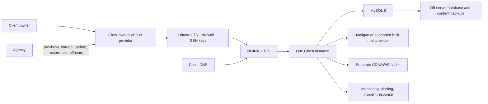
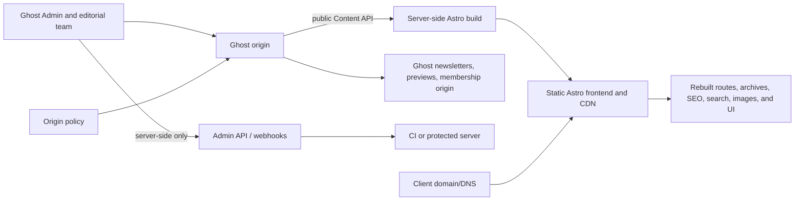

# Phase 3 — Ghost architecture and service model

Status: research synthesis for Checkpoint 1 owner review. This document is provisional and does not authorize an account, purchase, deployment, DNS change, or production launch.

Retrieval date for external evidence: 2026-09-22 (UTC). Prices, plan limits, versions, repository signals, and vendor claims are volatile and must be rechecked before customer-facing use.

Evidence labels:

- FACT — stated in or directly observed from a cited source.
- ESTIMATE — arithmetic or judgement derived from the evidence.
- RECOMMENDATION — proposed operating choice, pending the applicable owner checkpoint.
- UNKNOWN — not established by the available evidence.

## 1. Executive decision

**RECOMMENDATION:** Native Ghost themes are the default Ghost delivery architecture. They keep Ghost's publication, membership, Portal, newsletter, preview, archive, SEO, and routing surfaces on the supported Ghost-served frontend. A custom theme is appropriate when the required visual or information-architecture change fits Ghost's documented theme contracts; “custom-looking” alone is not a headless reason.

**RECOMMENDATION:** Ghost(Pro) is the default hosting recommendation for a normal client publication because it removes server, database, TLS, CDN/WAF, email-delivery, and routine update duties from the client and agency. The comparison is by total responsibility and operating risk, not by the headline VPS price. Self-hosting is an exceptional, separately scoped engineering service, not an agency hosting product.

**RECOMMENDATION:** Keep the Ghost(Pro) account, domain, Stripe account, sending-domain DNS, repository, exports, and retained backups in the client's name. Work in isolated client environments. Do not build a proprietary Ghost hosting platform, reseller runtime, shared multi-tenant service, or agency-owned data store.

**RECOMMENDATION:** Headless Ghost plus Astro is allowed only after a named functional gap, a signed rebuild-obligation register, an origin/ownership plan, and a priced recurring compatibility plan all pass. If one condition fails, use a native theme.

### 1.1 Evidence and execution boundary

The two Phase 3 research artifacts are documentation-, page-render-, repository-, and registry-backed research. They did not install Ghost, create an account, connect Stripe, send email, run GScan against a theme, perform an import/export, create a backup, execute a restore, or deploy a native or headless site. No claim below turns documentation into an executed proof.

The Ghost release-cadence observation in the hosting artifact is corrected here: the newer repository/API evidence reported Ghost `v6.65.0` on the retrieval date, so the earlier `v6.38.0` page capture is treated as a capture artifact rather than evidence that releases stopped [51].

## 2. Three supported architecture patterns

### 2.1 Default: native Ghost on Ghost(Pro)

```mermaid
flowchart LR
    C[Client owner and staff] -->|Admin/editor access| GP[Ghost(Pro) publication]
    GP --> T[Client-specific native Handlebars theme]
    GP --> M[Members, Portal, Stripe tiers]
    GP --> N[Newsletters and transactional email]
    GP --> CDN[Ghost-managed CDN, TLS, platform operations]
    D[Client domain and DNS] --> GP
    S[Theme source repository] -->|zip upload or approved CI action| GP
    A[Agency] -->|bounded setup, theme work, migration, training| GP
```

Ghost(Pro) includes platform services such as worldwide CDN, free SSL, automatic updates, automated-backup marketing language, threat/uptime management, and managed deliverability in its plan comparison [1]. The client's owner controls billing and the site account [14]. The account remains client-owned; the agency supplies bounded work and handover rather than becoming the platform operator.

### 2.2 Exceptional: self-hosted Ghost



Self-hosting requires the operator to own the application stack, operating system, database, mail, TLS, edge, backups, monitoring, incident response, and offboarding. Ghost documents one Ghost instance per site and recommends a CDN/cache layer for scale; it does not support a load-balanced Ghost cluster [2][9]. The architecture is viable for a client who accepts those duties, but it is not the low-cost default.

### 2.3 Exceptional: headless Ghost plus Astro



The Content API is public-data-only and may be used in browser code, but the Admin API key is secret and is restricted to secure server-side environments [43][44]. Headless does not remove Ghost's product responsibilities: it adds a second frontend, build, origin, redirect, compatibility, and QA surface.

## 3. Hosting and responsibility model

### 3.1 Ghost(Pro) plan facts and the Starter correction

**FACT:** On the live pricing page at the 1,000-member audience band, the observed annual-billed prices were Starter $15/month, Publisher $29/month, and Business $199/month; monthly-billed prices were $18, $35, and $239. Ghost(Pro) prices also change with the audience slider for Publisher and Business [1].

**FACT:** The plan table lists custom themes and marketplace themes as unavailable on Starter, and paid subscriptions, custom sending domains, and Admin API/webhook/custom-integration access begin above Starter [1]. The Help Center separately says only official themes can be used on Starter; premium and custom themes are available above it [49].

**CLARIFICATION:** The current, specific plan-table and Help Center evidence controls this recommendation: Starter is an official-theme-only path; a client needing a custom or premium theme must budget for Publisher or higher [1][49].

Selected observed annual-billing ladder, USD/month, retrieved 2026-09-22:

| Audience band | Starter | Publisher | Business |
|---|---:|---:|---:|
| Up to 1,000 | $15 | $29 | $199 |
| Up to 2,500 | $15 | $46 | $199 |
| Up to 10,000 | $15 | $88 | $199 |
| Up to 25,000 | $15 | $141 | $266 |
| Up to 100,000 | $15 | $274 | $399 |

At 100,000 members the observed monthly-billed Publisher and Business values were $329 and $479; above 100,000, those cards asked the customer to contact Ghost [1]. These are pass-through client costs, not agency prices.

Ghost(Pro) plan limits relevant to a proposal include one, three, fifteen, or unlimited staff users; one, three, ten, or unlimited newsletters; registered-member table values of 1,000, 1,000, 10,000, or unlimited; custom themes from Publisher; paid tiers from Publisher; custom sending domains from Publisher; and Admin API/webhooks/custom integrations from Publisher [1]. Exceeding a plan's member limit disables publishing until the plan is upgraded, so audience and staff growth must be treated as scope inputs [14].

Ghost(Pro) does not provide customer SSH or FTP access, and its Fastly CDN does not support stacking another CDN in front of the service [18][19].

### 3.2 Self-hosting is a full stack, not a VPS line

Ghost's supported self-hosted baseline is Ubuntu 22.04, 24.04, or 26.04 LTS, Node 22 LTS, MySQL 8.0 or 8.4, NGINX, systemd, at least 1 GB memory, and a non-root user; MySQL 8 is the supported production database, while SQLite is development-only and MariaDB is unsupported [2][3][12]. The Docker path exists, but Ghost labels the Docker installation path a preview and the split-out web-analytics/ActivityPub path has additional constraints [4].

Ghost documents a component comparison of $10/month base hosting, $20 CDN/WAF, $15 email newsletter delivery, $10 analytics, $5 full-site backups, and $12 image editing for self-hosting: a **$72/month advertised component floor** before labour, staging, monitoring, restore tests, incident response, or offboarding. The delegated lines excluding base hosting total **$62/month**; neither figure is a quote or a complete operating cost [2].

**ESTIMATE:** The $10 VPS is only about 14% of that $72 component floor. A responsible self-hosted quote must add measured setup and maintenance hours, client-specific staging if required, alerting, backup storage, restore tests, security response, mail reputation work, and a named responder. Those labour and responsibility inputs are **UNKNOWN** until the pilot records them.

| Responsibility | Ghost(Pro) | Self-hosted |
|---|---|---|
| Provisioning, OS, NGINX, MySQL, firewall | Vendor-managed / not customer-visible | Client or contracted operator |
| Ghost and Node updates | Ghost applies routine updates; owner-initiated major upgrade path | Operator schedules, tests, applies, and rolls back |
| TLS, CDN/WAF, rate limiting | Included within documented plan/vendor boundaries | Operator sources and maintains them |
| Newsletter delivery | Managed by Ghost(Pro) | Bulk provider required; basic SMTP is insufficient |
| Database/content backups | Marketing and help pages say automated/managed, but Terms place backup responsibility on the customer | Operator must schedule, retain, replicate, verify, and restore-test |
| Monitoring and incident response | Vendor platform operation and status channel | Operator must define tools, alerting, responder, and escalation |
| Product support | Plan-dependent Ghost support | Community forum for self-hosters |
| Server/database access | No SSH or FTP | Direct access, with corresponding security responsibility |

Ghost's own comparison says self-hosting is often more expensive after component services are included, especially for heavier users [2]. **RECOMMENDATION:** keep self-hosting out of the opening offer surface unless a named client requirement and measured operating plan justify it.

### 3.3 Updates, backups, restore, and security

Ghost documents weekly or typically one-to-two-week minor releases and major versions roughly every 12–18 months; major updates require compatibility review, backups, and theme/API checks [5][6][7]. Ghost 6 requires Node 22 and MySQL 8, and the breaking-change catalogue should be reviewed before updating custom themes, integrations, APIs, webhooks, or headless builds [11][12][50]. The newer release API observation supports normal current cadence rather than the older page-capture concern [51].

For self-hosting, `ghost update` has a rollback path, but the operator must maintain memory headroom and coordinate Node changes separately. The documented manual backup includes a Ghost export, member CSV, themes, media, and route files; disaster recovery or exact replication additionally requires a MySQL dump and the `content/` folder [5][8].

A documented restore sequence is to stop Ghost, restore the SQL dump and content, correct ownership, start Ghost, re-import routes/redirects/theme/members, and reconnect the same Stripe account in live mode before importing members [8]. This sequence was not executed in the research task.

Ghost(Pro)'s plan table advertises automated backups, while its Help Center says archives are not a service-continuity backup and its Terms say the customer is solely responsible for securing and backing up content [1][15][21]. **RECOMMENDATION:** every client engagement must define who retains exports, where they live, how often they are refreshed, and whether a restore has been tested; never imply that a marketing feature row is a tested recovery guarantee.

Self-hosted hardening includes HTTPS for admin, a non-root operator, SSH keys rather than password/root login, firewall rules, secure MySQL setup, dependency updates, and a separate admin-domain option [3][10]. **UNKNOWN:** the official self-hosting documentation does not establish a monitoring/alerting product, RPO, RTO, restore-test cadence, or complete incident-response procedure [2].

## 4. Native theme architecture and delivery

### 4.1 Theme contracts

Ghost themes are Handlebars templates plus CSS, rendered by Ghost with a separation between templates and helper logic; the server delivers publication content as HTML [24]. The minimum theme contract is `index.hbs`, `post.hbs`, and `package.json`; `default.hbs` is the recommended base layout containing `{{ghost_head}}` and `{{ghost_foot}}` [25]. Required helpers include `{{asset}}`, `{{body_class}}`, `{{post_class}}`, `{{ghost_head}}`, and `{{ghost_foot}}` [25].

Optional templates include home, page, post/page slug variants, custom templates, tag, author, private, error, and robots templates. Ghost's contexts and helpers provide the content, author, tag, membership, navigation, pagination, image, metadata, tier, and recommendation data used by those templates [26][27]. `{{#get}}` performs server-side queries before rendering and caps `limit` at 100 [28].

`{{ghost_head}}` emits metadata, Schema.org JSON-LD, Open Graph, Twitter Cards, RSS discovery links, Ghost API scripts, and code injection; removing it is therefore not a harmless markup change [29]. Ghost manages routes, collections, taxonomies, redirects, trailing-slash behaviour, and route/slug collision rules through `routes.yaml` and `redirects.yaml` [30]. Images in post content are resized by Ghost, while theme image sizes are declared in `package.json`; the docs recommend no more than ten declared sizes [31]. Custom settings support `select`, `boolean`, `color`, `image`, and `text`, with a hard total of 20 settings [32].

Native Ghost also supplies server-level member access controls, generated archives and feeds, search, previews, SEO metadata, and sitemap when the theme preserves the required contracts [37][42][46]. These are operational reasons to prefer native themes, not merely implementation convenience. Recommendations are also a Ghost-native distribution surface that a headless build must explicitly retain or replace [53].

Ghost's publishing workflow includes live previews for different visitor/member states, test emails, scheduling, and publish-as-newsletter behaviour [47].

### 4.2 Reusable, not multi-tenant

**RECOMMENDATION:** maintain a design-neutral internal checklist and a per-client copy of the official Starter-derived scaffold. Do not operate a shared runtime, shared theme, or agency-owned multi-tenant build service.

Legitimately reusable engineering patterns are the Starter's build/zip/test scripts, the `gscan --fatal --verbose` CI gate, the Ghost deploy-action shape, required-helper checks, semantic/accessibility checks, and a handover checklist [34][35][36]. The source repository, visual identity, routing, taxonomy, navigation, copy, custom-setting values, membership configuration, Stripe account, sending domain, and exports remain client-specific.

The Starter package currently documents local development, `pnpm install`, development mode, build, zip, test, and CI scanning scripts [35]. A client receives its source repository and theme zip; no client credential is embedded in the theme or browser bundle.

### 4.3 Delivery and validation workflow

This is a documented workflow, not an executed result:

1. Copy the official Starter template into the isolated client repository.
2. Develop against a local Ghost install, symlinking the theme into `content/themes`.
3. Configure templates, partials, routes, redirects, navigation, custom settings, responsive images, and accessibility semantics.
4. Run the documented build and zip commands, then run GScan locally and in CI.
5. Upload the theme zip in Ghost Admin or use the official GitHub Action, with the Admin API secret stored only in protected CI [34][36].
6. Review the GScan report, Ghost upload gate, responsive states, keyboard/focus/semantics, metadata, sitemap, links, previews, and the agreed membership/newsletter paths.
7. Hand over the source repository, theme zip, version, change log, account ownership, export checklist, and rollback notes.

GScan checks errors, deprecations, feature support, and compatibility; Ghost automatically runs it on theme upload and blocks fatal-error themes [33]. The research task did not run GScan against a theme, so no theme is claimed to have passed.

## 5. Product features and service boundaries

| Capability | Native Ghost responsibility | Self-hosted / headless implication | Agency and client boundary |
|---|---|---|---|
| Members and authentication | Ghost stores members and provides passwordless magic-link/one-time-code flows | Self-hosters configure mail; headless builders would own a separate frontend/session problem | Client chooses consent, access model, tiers, and legal text; agency configures only agreed scope |
| Content access | Public, members-only, paid-members-only, and tier-specific access is enforced at the Ghost server layer | Headless cannot assume native visitor-specific gating | Do not promise headless membership without a tested, supported design |
| Portal | Ghost-served membership UI works with native themes and is configured in Admin | The Help Center says subscription management is unavailable in headless; Ghost's breaking-change documentation describes external embedding, so external Portal remains UNKNOWN until tested [42][50] | Use native Portal by default; client owns support email, terms, tiers, and account decisions |
| Stripe and paid tiers | Stripe Connect uses the publisher's own account; Ghost takes 0% of revenue, while normal Stripe fees apply | A headless build must preserve or replace the native flow and its security boundary | Client owns Stripe, prices, offers, taxes, refunds, and payout decisions; agency does not hold funds |
| Newsletters | Ghost can schedule, segment, and send web posts as email; Ghost(Pro) manages delivery | Self-hosted requires Mailgun API configuration; basic SMTP cannot send bulk newsletters | Client owns audience, consent, content, sender identity, and deliverability decisions |
| Transactional email | Member authentication mail is distinct from bulk newsletter delivery | Self-hosted standard mail configuration remains an operator duty | Agency configures documented settings only; no deliverability guarantee |
| Custom sending domain | Publisher+; custom domain and DMARC required; warm-up is approximately six weeks | Self-hosted provider/DNS/reputation are operator duties | Client owns DNS and sending reputation; agency documents records and verifies configuration |
| Content API | Read-only public data, safe for browser use | Headless build must paginate and respect origin/media behaviour | Public Content API key may be used as designed; no private data assumption |
| Admin API and webhooks | Full administrative operations and event delivery | Requires server-side secret storage and authenticated webhook handling | Admin keys stay in protected CI/server; client owns integration account and revocation |
| Search, comments, recommendations, social web | Native bundles and Ghost-side services | Headless rebuild or drop decision required; social web has separate domain/subdirectory constraints | Treat each as a named scope item, not an implied feature |

Ghost's membership model includes four access levels and server-level gating, while Portal provides the member UI and account/subscription screens [37][38]. Stripe is the client's account and Ghost's native integration takes 0% of revenue, excluding Stripe's own processing fees [39].

The member dashboard supports search, notes, import/export, and segments, with double opt-in affecting which unconfirmed addresses are exposed [48].

Ghost supports one newsletter by default, additional configurable newsletters, segment delivery, scheduling, and publish-as-email behaviour. On Ghost(Pro), email delivery is included; self-hosted bulk delivery requires the supported provider configuration and authentication mail remains a separate standard-mail concern [40].

Self-hosted production configuration requires a mail block and separate mail settings for authentication or other transactional messages [13].

A custom sending domain is a Publisher-or-higher feature, requires the custom domain and DMARC, and warms up over approximately six weeks; some mail continues to use `ghost.io` during warm-up [20]. This is a configuration and DNS responsibility, not an agency deliverability outcome.

### 5.1 API and secret rules

1. Never put an Admin API key, key secret, JWT, Stripe secret, Mailgun key, webhook signing secret, or private environment variable in browser code.
2. Keep Admin API credentials in protected server-side CI or a server function, with least privilege and a documented rotation/revocation path [44].
3. Content API keys are public-data keys documented as safe for browser use, but they do not grant membership, payment, or administrative access [43].
4. Validate webhook origin/authentication and payloads server-side before triggering a build or other state change [45].
5. Paginate Content API requests because Ghost 6 removed `?limit=all` and caps API pages at 100 [50].

## 6. Headless exception and rebuild obligation

### 6.1 Decision criteria

A headless recommendation **must pass all four** criteria below and record the result in the statement of work:

1. **Named functional gap:** a verifiable requirement that native Handlebars templates, partials, custom settings, routes, and Ghost bundles cannot meet within the accepted scope and budget. “We want a custom-looking design” is not sufficient.
2. **Rebuild register accepted:** the client accepts which native behaviours are rebuilt, dropped, or retained at the Ghost origin, including the recurring maintenance burden.
3. **Origin and ownership plan:** the client approves the public Ghost origin, private-site/noindex or duplicate-content plan, email-link targets, DNS, and who owns each account.
4. **Maintenance and cost plan:** build, search, SEO, image, authentication, preview, API-pagination, release-compatibility, and incident work are priced rather than silently absorbed.

Ghost describes its architecture as a decoupled REST API with separate admin and frontend layers, so headless delivery is technically supported; that fact does not remove the product features and maintenance obligations below [52].

Ghost explicitly says that membership functionality is not compatible with headless setups for paid subscriptions, gating, comments, analytics, offers, complimentary plans, and trials. It also says a headless frontend must rebuild archives, sitemap, SEO fallbacks, Open Graph, Twitter Cards, custom routes, pagination, and code-injection behaviour [41]. Ghost(Pro)'s headless guidance additionally identifies the loss of its Fastly CDN benefit, Ghost-origin View-in-Browser/unsubscribe links, and the need for a custom theme so the Ghost origin's content is not exposed to search [42].

### 6.2 Rebuild-obligation checklist

This checklist is a quote gate. Each row must be marked **rebuild**, **drop**, or **retain at Ghost origin**, with an owner and verification method.

| ID | Native behaviour | Headless obligation |
|---|---|---|
| R1 | Stripe paid subscriptions and tier gating | Rebuild with a supported design or retain Ghost frontend; do not assume native gating crosses the API |
| R2 | Portal signup, sign-in, account, billing, offers, and trials | Treat subscription management as unavailable; external embed is an unresolved exception |
| R3 | Passwordless member auth, sessions, and gated responses | Own a secure auth/session architecture or keep the native frontend |
| R4 | Newsletter sending, segmentation, scheduling, and welcome mail | Keep production sending in Ghost; the Astro frontend is not the mail system |
| R5 | Newsletter View-in-Browser and unsubscribe links | Preserve the Ghost origin; blanket redirects can break these links |
| R6 | Public/free/paid previews and preview URLs | Rebuild preview handling and test origin/redirect behaviour |
| R7 | Native search and its index | Rebuild search or adopt the documented Algolia path; define scope beyond 10,000 posts [60] |
| R8 | Recommendations and Portal recommendations | Rebuild or drop Webmention/recommendation surfaces |
| R9 | ActivityPub/social web profile, reader, followers, and interactions | Keep the Ghost social origin and its domain constraints, or explicitly drop it [55] |
| R10 | Member comments, replies, likes, moderation, and notices | Rebuild with member identity or drop native comments [54] |
| R11 | Native analytics, member sources, newsletter metrics, and link tagging | Replace with a tested analytics design and privacy boundary |
| R12 | Sitemap, canonical, Open Graph, Twitter Cards, structured data, and RSS | Generate and verify all SEO plumbing |
| R13 | Tag/author archives, pagination, custom routes, and code injection | Recreate routing and archive behaviour with content fixtures |
| R14 | Responsive images, resizing, and CDN delivery | Rewrite/download assets or retain Ghost as the image origin |
| R15 | Theme access to member/visibility/access variables | Replace visitor-specific rendering or retain Ghost frontend |
| R16 | Custom sending-domain and deliverability workflow | Keep Ghost mail/origin and document its DNS/warm-up responsibility |

Ghost documents that newsletter unsubscribe and browser-view links resolve to the Ghost origin, that blanket redirects can make previews fragile, and that API images intentionally point to the Ghost origin [40][41]. The register is therefore a permanent operating boundary, not a one-time frontend task.

**UNKNOWN:** The research did not test external Portal signup, sign-in, paid checkout, account management, cross-origin cookies, member endpoints, preview redirects, or any headless deployment. The Portal documentation conflict is recorded rather than silently resolved: the Help Center rejects subscription management in a headless setup, while Ghost's breaking-change documentation describes an external embed [42][50].

## 7. Initial service menu and maintenance boundaries

All recommendations below are provisional until Checkpoint 1 and measured pilot data. No final service price is set here.

### 7.1 Ghost publication launch

**Outcome:** A client-owned, working native Ghost publication with agreed content structure, theme configuration or bounded theme customization, membership/newsletter setup, migration/import, QA, training, and handover.

Included, when explicitly scoped:

- Client Ghost(Pro) account or another client-owned host; plan-tier check before theme, paid-tier, API, or sending-domain work.
- Domain/DNS coordination with the client owner; no agency ownership of the domain or billing.
- Official-theme selection or a client-specific Starter-derived theme copy.
- Bounded templates, partials, custom settings, navigation, routes, redirects, responsive images, metadata, and accessibility work.
- Membership/Portal/Stripe/newsletter configuration assistance; the client chooses business rules, prices, legal text, consent, sender identity, and payment settings.
- Bounded migration/import, URL inventory, redirects, archive checks, and rollback/export notes.
- GScan validation for any theme we ship, plus documented manual keyboard/focus/semantics and responsive checks.
- Staff training, least-privilege access review, source/theme handover, export checklist, and written support boundary.

Excluded unless separately quoted: copywriting, legal/tax advice, membership economics, deliverability guarantees, ongoing content entry, unbounded archive cleanup, custom integrations, headless frontend, 24/7 support, uptime guarantees, and self-hosted infrastructure.

### 7.2 Migration or remediation

**Outcome:** A bounded migration into native Ghost or measurable remediation of an agreed Ghost/theme/redirect/accessibility/performance/security issue set.

Ghost publishes platform-specific migration guides and a custom JSON route, while its importer supports common platforms and Ghost-to-Ghost imports with JSON or image-inclusive archives [23][57][58].

Acceptance evidence is a source/URL inventory, redirect-map review, content-count or sample parity, before/after checks where applicable, GScan output for a shipped theme, rollback/export notes, and a handover record. A migration does not promise ranking, traffic, deliverability, revenue, or perfect third-party data fidelity.

### 7.3 Exceptional self-hosted engagement

Self-hosting is not part of the default launch package. If a client explicitly requires it, the statement of work must separately name provisioning, hardening, OS/Node/MySQL/NGINX/Ghost updates, TLS, CDN/WAF, mail provider and DNS, backup schedule/retention/replication, restore-test cadence, monitoring/alerting, responder and escalation, incident handling, staging, theme compatibility, access revocation, and offboarding.

A VPS invoice alone is never the maintenance boundary. If the required monitoring, RPO/RTO, restore cadence, or responder capacity is not funded and assigned, self-hosting fails the proposal gate.

### 7.4 Maintenance boundary

**RECOMMENDATION:** Do not sell an unlimited or implied care retainer at launch. Ghost(Pro) absorbs routine platform work, but a custom theme still needs compatibility review and client-owned exports still need an agreed procedure. A future care agreement may cover a stated monthly review, theme/GScan compatibility, scoped content or configuration changes, export reminders, access review, and a response window; it must exclude unlimited edits, guaranteed uptime, guaranteed deliverability, legal compliance, and unbounded incident response.

Self-hosted care additionally requires the full operational stack in §3.2–§3.3. If the agency cannot staff it, the client must contract a capable operator or use Ghost(Pro).

### 7.5 Responsibility matrix

| Activity | Ghost/vendor | Agency | Client owner |
|---|---|---|---|
| Platform billing, plan, cancellation | Ghost processes plan | Explain implications | Owns and executes |
| Domain/DNS and sending records | Provider documentation | Coordinate and verify | Owns account and approval |
| Theme source and zip | Ghost stores active theme | Create, validate, document | Owns repository/access after handover |
| Content, consent, legal pages | Product mechanisms | Configure agreed fields | Owns accuracy and legal decisions |
| Stripe, tiers, offers, refunds | Stripe/Ghost integration | Configure only with authorization | Owns Stripe and financial policy |
| Newsletter audience and copy | Ghost delivery service | Configure/test agreed path | Owns audience, sender, content |
| Backups and exports | Vendor claims/features subject to Terms | Define procedure if contracted | Retains client copies and approvals |
| Updates and compatibility | Ghost(Pro) routine updates | Review custom theme when contracted | Approves breaking-scope work |
| Monitoring and incident response | Vendor status/support boundary | Only if explicitly contracted | Owns self-hosted provider relationship |
| Offboarding | Provider deletion rules | Produce checklist and transfer | Exports before cancellation and revokes access |

## 8. Ownership, portability, licensing, and offboarding

The client's owner should invite the agency as the least-privileged role that supports the work. On Ghost(Pro), billing, plan changes, custom-domain activation, and cancellation are owner-only actions; ownership can be transferred to an existing administrator [14][17]. Ghost(Pro) provides self-service content JSON, members CSV, theme zip, and post-analytics CSV exports; a full archive including images must be requested before cancellation, and it is unavailable after cancellation [15][16].

Ghost's published DPA treats the customer as controller and Ghost as processor, with subprocessor and security details available through the DPA process [22].

Cancellation deletes the site and account at the end of the billing cycle, so offboarding must happen before that deadline [14]. The handover checklist must record content JSON, member CSV, theme zip/source, post-analytics CSV, requested image/full archive, routes/redirects, DNS records, Stripe connection state, sending-domain records, staff list, owner identity, current plan/audience band, and residual-access revocation.

Ghost documents that JSON exports omit email analytics, member engagement data, and comments; exact self-hosted disaster recovery requires database and content-folder copies [8]. Paid-member continuity depends on the client's own Stripe account and reconnecting it before member import [8][39].

Ghost core, official themes, Starter, GScan, Ghost-CLI, official SDKs, and the official deploy action are MIT-licensed in the cited project/repository evidence [24][34][59]. Premium marketplace themes are separate third-party products whose license and support must be reviewed per purchase [49]. The marketplace is a distinct source of third-party themes and must not be treated as part of Ghost's MIT licence [56]. **RECOMMENDATION:** deliver each client's theme source and zip, record the applicable license, and do not turn the reusable scaffold into a theme product line before demand and support economics are proven.

## 9. Unknowns, conflicts, and limitations

The following remain explicit rather than smoothed over:

- **Starter price rendering conflict:** the 2026-09-22 live billing-toggle observation recorded $15/yearly and $18/monthly at the 1,000-member band, while automated extraction of the same page returned $18 with a “Billed yearly” label. Treat the live-toggle observation as the research basis, but recheck the page and billing frequency before quoting [1]. `docs/01-business.md` §3 and §8's limitations item 2, plus `research/phase-1/business-model.md` §12 L7, originally carried the $18-annual extraction; those upstream passages now distinguish the $15-annual live-toggle reading from the misleading extraction.
- **Portal/headless conflict — UNKNOWN:** the Help Center says Portal subscription management is unavailable in headless mode, while Ghost's breaking-change documentation describes an external embed [42][50]. No live member or Stripe flow was tested.
- **Ghost(Pro) SLA conflict:** the pricing table labels a 99.9% SLA only on Custom, while the Terms state a 98% minimum monthly uptime for active paid subscriptions with credit remedies. Neither should become an agency uptime promise [1][21].
- **Backup conflict:** pricing/help language presents managed or automated backups, while the Terms place responsibility on the customer and the archive page disclaims service-continuity backup. Use the safe operational interpretation: retain client exports and define restore responsibility [1][15][21].
- **Audience entitlement rule — UNKNOWN:** observed prices move with an audience slider, while plan cards also show member values; the pricing page does not fully explain the entitlement rule behind each band [1].
- **“Unlimited” email — UNKNOWN:** no numeric practical ceiling was established; acceptable-use terms still apply [1][21].
- **Official-theme count — UNKNOWN:** the marketplace applies filters client-side, so no official-theme count is claimed [49].
- **Self-hosted operations — UNKNOWN:** no official evidence established an agency-ready monitoring stack, RPO, RTO, restore-test cadence, or self-hosted incident-response playbook [2].
- **Version-sensitive values:** Ghost version, GScan version, package versions, plan prices, feature limits, and repository signals must be re-retrieved before any proposal or implementation.

### 9.1 Explicitly unexecuted

No Ghost account, trial, payment, theme scaffold, theme build, zip, upload, activation, GScan run, Content API request, Admin API request, webhook, Portal embed, member signup/sign-in, Stripe connection, newsletter send, custom sending-domain activation, import, export, backup, restore, DNS change, self-hosted deployment, headless Astro deployment, monitoring configuration, or CI deployment was executed by this research. These are future proof-of-concept tasks and must not be reported as verified behaviour.

## 10. Synthesis acceptance check

- Native Ghost themes are the default; headless requires four written pass conditions.
- Ghost(Pro) and self-hosting are distinguished by responsibility, risk, and total operating cost, not VPS price.
- The Starter theme boundary is clarified from the current plan/Help Center evidence: official themes only on Starter; custom/premium themes require a higher plan.
- Native theme contracts, reusable boundaries, Starter workflow, GScan, and deployment validation are documented without claiming execution.
- Memberships, Portal, Stripe, newsletters, transactional email, sending domains, Content API, Admin API, webhooks, and secret boundaries have named owners.
- The headless R1–R16 rebuild-obligation checklist is present, including the unresolved Portal conflict and Ghost-origin email-link limitation.
- Client ownership, exports, Stripe continuity, cancellation deadline, licensing, and offboarding are explicit.
- Initial service packages and maintenance/self-hosting boundaries are operationally specific; no hosting platform is proposed.
- Costs include Ghost(Pro) audience bands, the full self-hosted component floor, labour/monitoring/restore uncertainty, and the client/agency cost boundary.
- All recommendations remain provisional until Checkpoint 1; paid services, infrastructure, DNS, and public launch remain gated by the project approvals.

## Sources

[1] https://ghost.org/pricing — Ghost — Ghost(Pro) plans and pricing
[2] https://docs.ghost.org/hosting — Ghost developer docs — Hosting Ghost
[3] https://docs.ghost.org/install/ubuntu — Ghost developer docs — Install Ghost on Ubuntu
[4] https://docs.ghost.org/install/docker — Ghost developer docs — Install Ghost with Docker
[5] https://docs.ghost.org/ghost-cli — Ghost developer docs — Ghost-CLI
[6] https://docs.ghost.org/update — Ghost developer docs — How to update Ghost
[7] https://docs.ghost.org/update-major-version — Ghost developer docs — Update Ghost to the latest major version
[8] https://docs.ghost.org/faq/manual-backup — Ghost developer docs — Manual backup and restore
[9] https://docs.ghost.org/faq — Ghost developer FAQs
[10] https://docs.ghost.org/security — Ghost developer docs — Security
[11] https://docs.ghost.org/faq/node-versions — Ghost developer FAQ — Supported Node versions
[12] https://docs.ghost.org/faq/supported-databases — Ghost developer FAQ — Supported production databases
[13] https://docs.ghost.org/config — Ghost developer docs — Configuration
[14] https://ghost.org/help/manage-your-subscription — Ghost Help Center — Manage your Ghost(Pro) subscription
[15] https://ghost.org/help/automatic-back-ups — Ghost Help Center — Automatic backups
[16] https://ghost.org/help/exports — Ghost Help Center — Exporting content and data
[17] https://ghost.org/help/transfer-publication-ownership — Ghost Help Center — Transfer publication ownership
[18] https://ghost.org/help/ssh-ftp-access — Ghost Help Center — SSH/FTP access
[19] https://ghost.org/help/cdn-provider-support — Ghost Help Center — CDN provider support
[20] https://ghost.org/help/custom-sending-domains — Ghost Help Center — Custom sending domains
[21] https://ghost.org/terms — Ghost Foundation — Terms of Service
[22] https://ghost.org/dpa — Ghost Foundation — GDPR Data Processing Agreement
[23] https://ghost.org/move-to-ghost — Ghost — Move to Ghost migration service
[24] https://docs.ghost.org/themes — Ghost developer docs — Themes
[25] https://docs.ghost.org/themes/structure — Ghost developer docs — Theme structure
[26] https://docs.ghost.org/themes/contexts — Ghost developer docs — Theme contexts
[27] https://docs.ghost.org/themes/helpers — Ghost developer docs — Theme helpers
[28] https://docs.ghost.org/themes/helpers/functional/get — Ghost developer docs — `get` helper
[29] https://docs.ghost.org/themes/helpers/utility/ghost_head_foot — Ghost developer docs — `ghost_head` and `ghost_foot`
[30] https://docs.ghost.org/themes/routing — Ghost developer docs — URLs and dynamic routing
[31] https://docs.ghost.org/themes/assets — Ghost developer docs — Theme assets and responsive images
[32] https://docs.ghost.org/themes/custom-settings — Ghost developer docs — Theme custom settings
[33] https://docs.ghost.org/themes/gscan — Ghost developer docs — GScan
[34] https://github.com/TryGhost/Starter — GitHub — TryGhost/Starter
[35] https://raw.githubusercontent.com/TryGhost/Starter/main/package.json — GitHub raw — TryGhost/Starter package.json
[36] https://github.com/TryGhost/action-deploy-theme — GitHub — TryGhost/action-deploy-theme
[37] https://docs.ghost.org/members — Ghost developer docs — Memberships
[38] https://ghost.org/help/customize-portal — Ghost Help Center — Customize Portal
[39] https://ghost.org/help/stripe — Ghost Help Center — Connecting Stripe
[40] https://docs.ghost.org/newsletters — Ghost developer docs — Email newsletters
[41] https://docs.ghost.org/jamstack — Ghost developer docs — Ghost on the JAMstack
[42] https://ghost.org/help/can-i-run-a-headless-site-with-ghost-pro — Ghost Help Center — Headless Ghost(Pro)
[43] https://docs.ghost.org/content-api — Ghost developer docs — Content API
[44] https://docs.ghost.org/admin-api — Ghost developer docs — Admin API
[45] https://docs.ghost.org/webhooks — Ghost developer docs — Webhooks
[46] https://ghost.org/help/seo — Ghost Help Center — SEO in Ghost
[47] https://ghost.org/help/publishing-content — Ghost Help Center — Publishing and scheduling
[48] https://ghost.org/help/member-management — Ghost Help Center — Member management
[49] https://ghost.org/help/installing-a-theme — Ghost Help Center — Installing a theme
[50] https://docs.ghost.org/changes — Ghost developer docs — Breaking changes
[51] https://api.github.com/repos/TryGhost/Ghost/releases/latest — GitHub API — TryGhost/Ghost latest release
[52] https://docs.ghost.org/architecture — Ghost developer docs — Architecture
[53] https://docs.ghost.org/recommendations — Ghost developer docs — Recommendations
[54] https://ghost.org/help/commenting — Ghost Help Center — Comments
[55] https://ghost.org/help/social-web — Ghost Help Center — Social web
[56] https://ghost.org/themes — Ghost — Theme marketplace
[57] https://docs.ghost.org/migration — Ghost developer docs — Migration index
[58] https://ghost.org/help/imports — Ghost Help Center — Importing content
[59] https://docs.ghost.org/license — Ghost developer docs — License
[60] https://docs.ghost.org/themes/search — Ghost developer docs — Search
